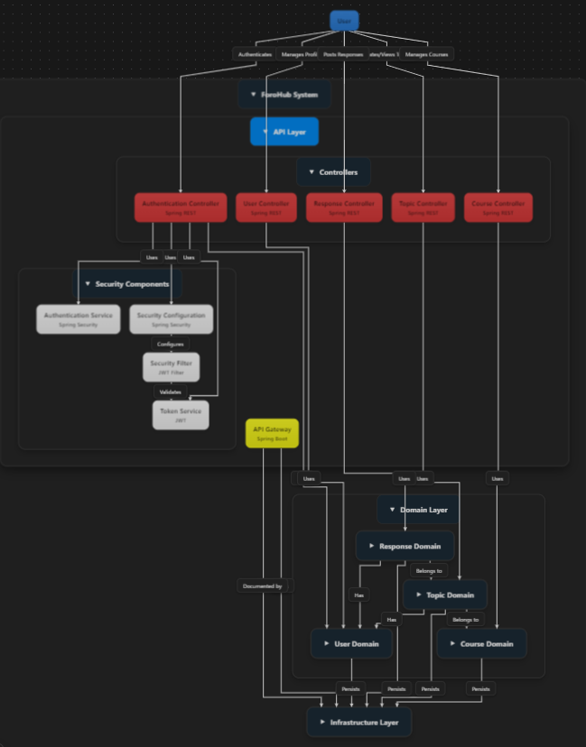

# ForoHub System

ForoHub es una plataforma basada en Spring Boot diseñada para crear, gestionar y participar en foros educativos. Este proyecto implementa un sistema robusto y seguro para usuarios, temas, cursos y respuestas.

---

## **Tabla de Contenidos**
1. [Características](#características)
2. [Arquitectura del Sistema](#arquitectura-del-sistema)
3. [Tecnologías Utilizadas](#tecnologías-utilizadas)
4. [Configuración e Instalación](#configuración-e-instalación)
5. [Endpoints Principales](#endpoints-principales)
6. [Contribución](#contribución)

---

## **Características**
- **Gestión de Usuarios**: Autenticación y autorización con JWT.
- **Gestión de Foros**: Creación y visualización de temas y respuestas.
- **Gestión de Cursos**: Asociación de cursos con temas y categorías.
- **Documentación de la API**: Generada con Swagger.
- **Seguridad**: Implementación de roles y permisos con Spring Security.

---

## **Arquitectura del Sistema**
El proyecto está diseñado con una arquitectura por capas:
- **Capa API**: Contiene los controladores REST y configuraciones de seguridad.
- **Capa de Dominio**: Define las entidades, repositorios y DTOs.
- **Capa de Infraestructura**: Incluye configuración de base de datos, manejo de errores y documentación de API.



---

## **Tecnologías Utilizadas**
- **Lenguaje**: Java 17
- **Framework Principal**: Spring Boot
- **Seguridad**: Spring Security, JWT
- **Acceso a Datos**: Spring Data JPA, Hibernate
- **Base de Datos**: MySQL
- **Documentación**: SpringDoc OpenAPI (Swagger)

---

## **Configuración e Instalación**

### **Prerrequisitos**
- JDK 17
- Maven 3.8+
- MySQL 8.0+

### **Pasos**
1. Clonar el repositorio:
   ```bash
   git clone https://github.com/castleortiz1/Challenge-ForoHub-AluraLatam
   cd forohub
   ```
2. Configurar la base de datos:
   - Crear una base de datos en MySQL.
   - Actualizar las credenciales en el archivo `application.properties`:
     ```properties
     spring.datasource.url=jdbc:mysql://localhost:3306/forohub
     spring.datasource.username=tu_usuario
     spring.datasource.password=tu_contraseña
     ```
3. Compilar y ejecutar la aplicación:
   ```bash
   mvn clean install
   mvn spring-boot:run
   ```
4. Acceder a la documentación de la API en:
   [http://localhost:8080/swagger-ui.html](http://localhost:8080/swagger-ui.html)

---

## **Endpoints Principales**

| Método | Endpoint                  | Descripción                            |
|--------|---------------------------|----------------------------------------|
| POST   | `/auth/login`             | Autenticar un usuario.                 |
| GET    | `/users`                  | Obtener lista de usuarios.             |
| GET    | `/topics`                 | Listar todos los temas.                |
| POST   | `/topics`                 | Crear un nuevo tema.                   |
| GET    | `/courses`                | Listar todos los cursos.               |
| POST   | `/responses`              | Publicar una respuesta en un tema.     |

---

## **Contribución**
¡Las contribuciones son bienvenidas! Para contribuir:
1. Haz un fork del proyecto.
2. Crea una nueva rama:
   ```bash
   git checkout -b feature/nueva-funcionalidad
   ```
3. Realiza tus cambios y haz un commit:
   ```bash
   git commit -m "Añadida nueva funcionalidad"
   ```
4. Sube tus cambios:
   ```bash
   git push origin feature/nueva-funcionalidad
   ```
5. Abre un pull request en el repositorio principal.

---

## **Licencia**
Este proyecto está bajo la Licencia MIT. Consulta el archivo `LICENSE` para más detalles.

---

¡Gracias por usar ForoHub! Si tienes preguntas, no dudes en abrir un issue o contactarnos directamente.

